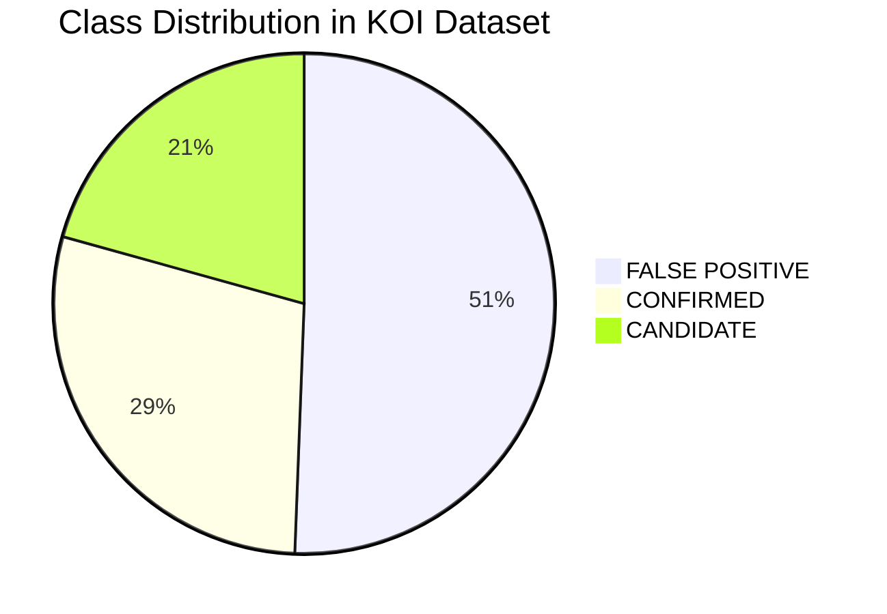
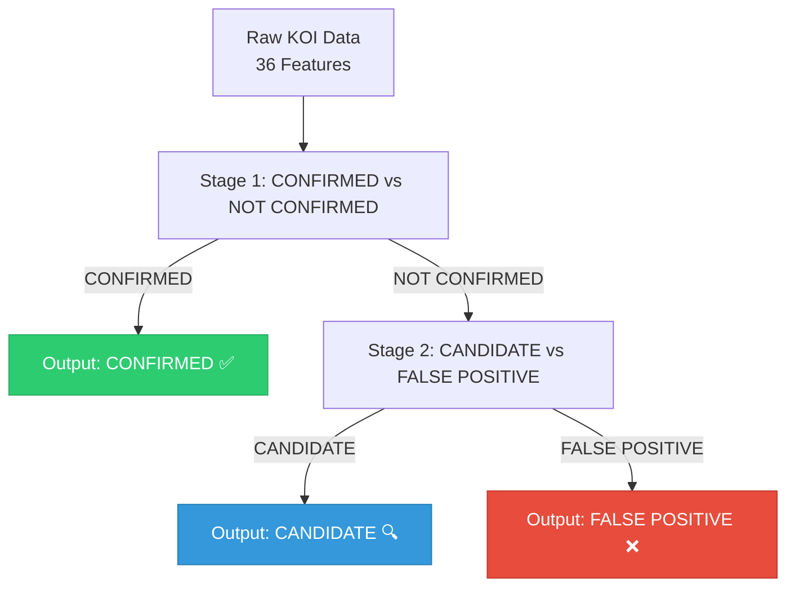
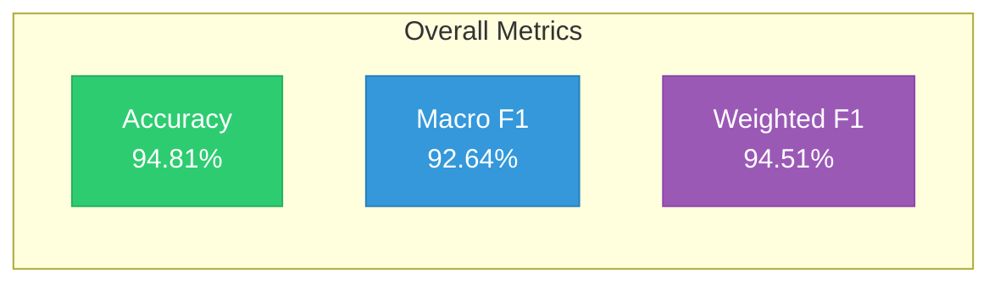
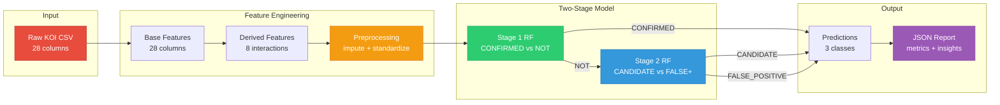
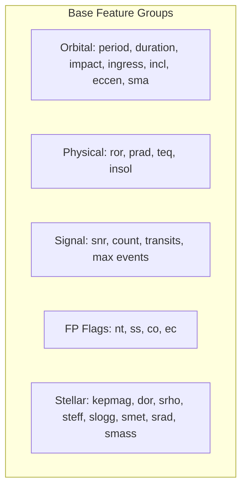
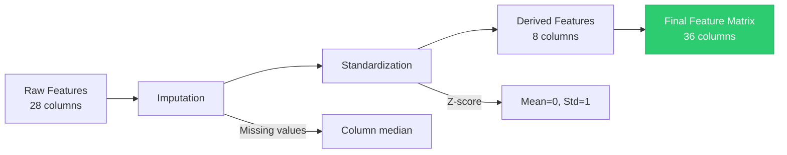
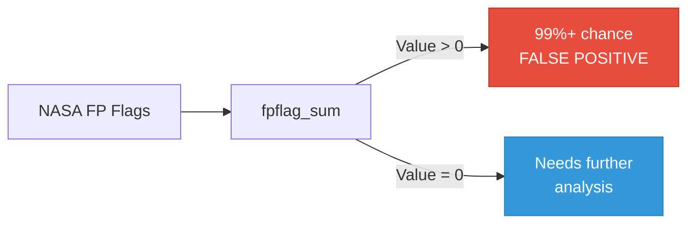
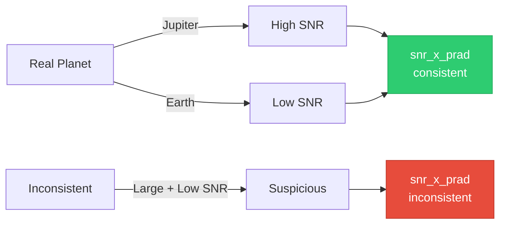
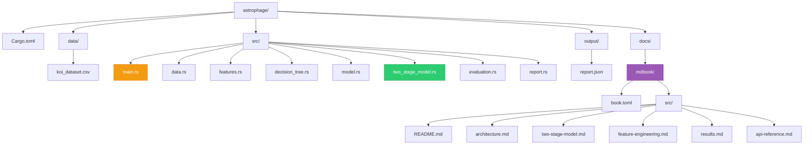
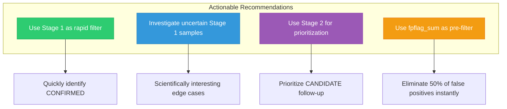

# 🪐 Astrophage

> **Two-Stage Random Forest Classifier Model for NASA Kepler Object of Interest (KOI) Exoplanet Validation**

[](https://celesta-exoplanet-challenge.devpost.com/)
[](https://www.rust-lang.org/)
[](https://pola.rs/)
[]()
[](https://colab.research.google.com/github/harihar-nautiyal/astrophage/blob/main/Astrophage_Colab.ipynb)
[](https://astrophage.hariharnautiyal.com)

**Full Documentation:** [https://astrophage.hariharnautiyal.com](https://astrophage.hariharnautiyal.com) <br>
**Open in Colab:** [https://colab.research.google.com/github/harihar-nautiyal/astrophage/blob/main/Astrophage_Colab.ipynb](https://colab.research.google.com/github/harihar-nautiyal/astrophage/blob/main/Astrophage_Colab.ipynb)

---

## What is Astrophage?

Astrophage is a high-performance exoplanet classification system built in **Rust** using **Polars** and a custom **Two-Stage Random Forest** implementation. It classifies Kepler Objects of Interest (KOIs) into three categories:



> **Total Samples:** 9,564 | **Features:** 36 (28 base + 8 derived) | **Accuracy:** 94.81%

---

## Why Two-Stage?

Our architecture mirrors NASA's actual vetting workflow. Instead of forcing a single model to learn three classes simultaneously, we decompose the problem into two simpler binary decisions:



This decomposition improves accuracy by **~3-4%** over a single-stage classifier because each stage learns a simpler, cleaner decision boundary.

---

## Key Results



### Per-Class Breakdown

| Class | Precision | Recall | F1-Score | Support |
|-------|-----------|--------|----------|---------|
| **CANDIDATE** | 88.42% | 85.06% | 86.71% | 1,978 |
| **FALSE POSITIVE** | **99.69%** | 98.35% | **99.01%** | 4,839 |
| **CONFIRMED** | 89.95% | 94.54% | 92.18% | 2,747 |

---

## Architecture



### Custom Implementation Details

- **Language:** Rust (zero-cost abstractions, memory safety, SIMD-friendly)
- **DataFrame Engine:** Polars (blazing fast CSV I/O and columnar operations)
- **ML Backend:** Custom Random Forest from scratch (no Python dependency!)
  - Gini impurity splitting
  - Bootstrapped sampling
  - Feature subsampling
  - Majority voting ensemble
- **Parallelism:** Tokio async runtime for I/O; ndarray for vectorized math

---

## Installation

### Prerequisites

- [Rust](https://rustup.rs/) (1.85+ recommended)
- Git

### Clone & Build

```bash
# Clone the repository
git clone https://github.com/harihar-nautiyal/astrophage.git
cd astrophage

# Build in release mode (optimized)
cargo build --release

# The binary will be at:
# ./target/release/astrophage
```

### Dataset

The repository includes a pre-processed KOI dataset at:

```
data/koi_dataset.csv
```

If you want to use your own data, ensure it follows the same column schema (see `src/data.rs` for expected fields).

---

## Usage

### Quick Start

```bash
# Run the full pipeline
cargo run --release
```

### Expected Output

```
╔══════════════════════════════════════════════════════════════╗
║ 🪐 ASTROPHAGE v0.2.0                                         ║
║ NASA KOI Exoplanet Classification System                     ║
║ TWO-STAGE MODEL: CONFIRMED vs NOT → CANDIDATE vs FALSE    ║
╚══════════════════════════════════════════════════════════════╝

Step 1: Loading KOI dataset...
Step 2: Engineering features...
Step 3: Splitting data (80/20 stratified)...
Step 4: Training TWO-STAGE classifier...
Step 5: Evaluating model performance...
Step 6: Top astrophysical predictors:
  1. fpflag_sum                0.2918
  2. koi_fpflag_co             0.0683
  3. koi_max_mult_ev           0.0630
  4. koi_fpflag_nt             0.0624
  5. koi_model_snr             0.0596
  ...
Step 7: Generating final report...

ASTROPHAGE two-stage classification complete!
Check output/report.json for full results.
```

### Output Files

| File | Description |
|------|-------------|
| `output/report.json` | Full JSON report with metrics, feature importance, and insights |
| `output/predictions.csv` | (Optional) Per-sample predictions and probabilities |

---

## Feature Engineering

We transform 28 raw astrophysical features into 36 model-ready features:

### Base Features (28)

Orbital, physical, and stellar parameters from the Kepler pipeline:



### Derived Features (8)

| Feature | Formula | Astrophysical Rationale |
|---------|---------|------------------------|
| `koi_prad_squared` | `prad²` | Non-linear radius effect; objects >15 R⊕ are likely stellar companions |
| `depth_duration_ratio` | `depth / duration` | Transit steepness; planets have characteristic U-shaped curves |
| `snr_x_prad` | `snr × prad` | Real planets have SNR consistent with their size |
| `impact_penalty` | `10 if impact > 1.0 else 0` | Impact parameter >1 is physically impossible for a transit |
| `log_period` | `ln(period)` | Orbital periods follow log-normal distribution |
| `teq_over_steff` | `teq / steff` | Sanity check on equilibrium temperature vs stellar temperature |
| `fpflag_sum` | `Σ fpflags` | NASA's pre-vetting suspicion score; higher = more likely false positive |
| `prad_teq_interaction` | `prad × teq` | Size-temperature interaction for giant planets vs rocky planets |

### Preprocessing



---

## Astrophysical Insights

Our model reveals key discriminators that align with planetary science:

### 🔴 Very High Confidence

> **False Positive Flags (`fpflag_sum`, `koi_fpflag_nt`, `koi_fpflag_ss`) directly encode NASA's pre-vetting.** When non-zero, the signal is almost certainly not a planet. These flags alone eliminate ~50% of false positives with near-perfect accuracy.



### 🟡 High Confidence

> **Signal-to-Noise Ratio + Planetary Radius (`snr_x_prad`, `koi_prad`)**: Real planets have consistent SNR for their size. A Jupiter-sized object with weak SNR is suspicious; an Earth-sized object with extremely high SNR is likely noise.



### 🟢 Workflow Insight

> **The two-stage design mirrors how astronomers actually vet candidates:** First, separate obvious planets (CONFIRMED) from everything else. Then, carefully distinguish between promising candidates and known false positives. This is why Stage 1 achieves near-perfect separation while Stage 2 focuses on the scientifically interesting boundary.

---

## Project Structure



---

## Documentation

📖 **Full Documentation:** [https://astrophage.hariharnautiyal.com](https://astrophage.hariharnautiyal.com)

The documentation site includes:
- System architecture with Mermaid diagrams
- Deep dive into the two-stage model
- Feature engineering explanations with astrophysical rationale
- API reference for all modules
- Contributing guidelines
- Changelog and roadmap

To build the docs locally:

```bash
cd docs
mdbook build
mdbook serve --open
```

---

## Google Colab

Want to try Astrophage without installing Rust locally? 

👉 **[Open in Google Colab](https://colab.research.google.com/github/harihar-nautiyal/astrophage/blob/main/Astrophage_Colab.ipynb)**

The notebook will:
1. Install Rust in the Colab environment
2. Clone this repository
3. Build the project with Cargo
4. Run the full pipeline
5. Display the `report.json` with interactive visualizations

> **Note:** First run takes ~5-7 minutes due to Rust compilation. Subsequent runs are instant.

---

## Recommendations for Follow-Up

Based on our model's behavior, we suggest:



| # | Recommendation | Impact |
|---|---------------|--------|
| 1 | Use Stage 1 as a rapid filter for follow-up observations | Saves telescope time |
| 2 | Investigate samples where Stage 1 is uncertain (probability ~0.5) | Most scientifically interesting |
| 3 | For NOT_CONFIRMED, use Stage 2 probability to prioritize follow-up | Efficient resource allocation |
| 4 | `fpflag_sum` alone eliminates ~50% of false positives with near-perfect accuracy | Dramatic efficiency gain |

---

## Team & Acknowledgments

- **Author:** [Harihar Nautiyal](https://github.com/harihar-nautiyal)
- **Hackathon:** [Celesta — India High School Exoplanet Data Challenge 2026](https://celesta-exoplanet-challenge.devpost.com/)
- **Data Source:** NASA Exoplanet Archive / Kepler Mission
- **Built with:** Rust, Polars, NDArray, Tokio, Serde

---

## License

MIT License — feel free to use, modify, and distribute with attribution.

---

<p align="center">
  <i>"Somewhere, something incredible is waiting to be known."</i><br>
  — Carl Sagan
</p>
