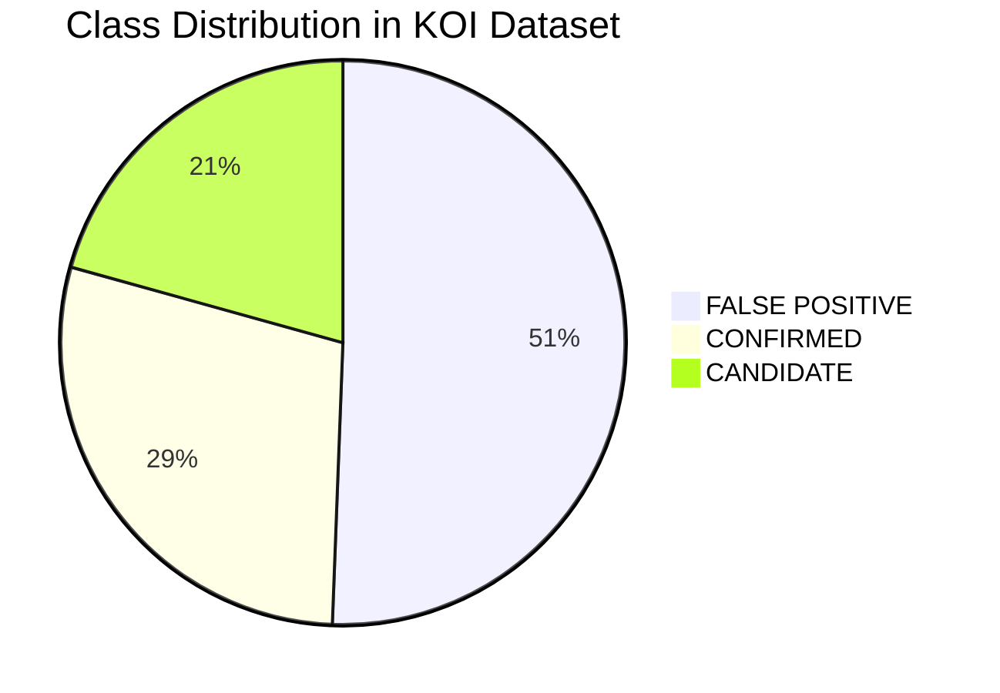
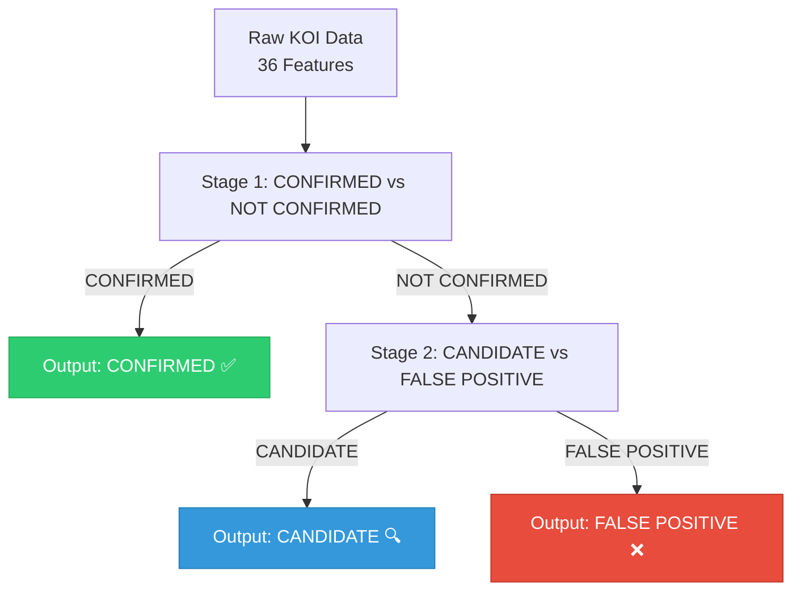
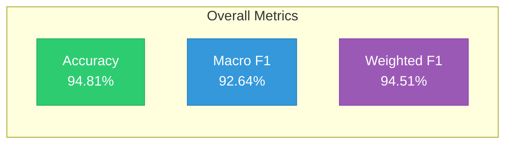
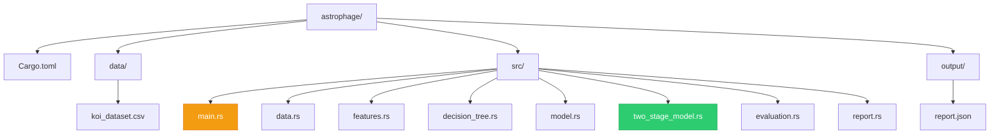
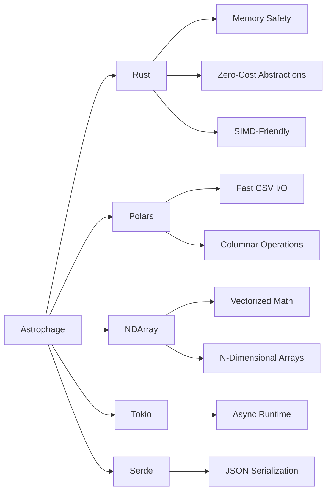

# 🪐 Astrophage

> **Two-Stage Random Forest Classifier Model for NASA Kepler Object of Interest (KOI) Exoplanet Validation**

[](https://celesta-exoplanet-challenge.devpost.com/)
[](https://www.rust-lang.org/)
[](https://pola.rs/)
[]()
[](https://colab.research.google.com/github/harihar-nautiyal/astrophage/blob/main/Astrophage_Colab.ipynb)

---

## What is Astrophage?

Astrophage is a high-performance exoplanet classification system built in **Rust** using **Polars** and a custom **Two-Stage Random Forest** implementation. It classifies Kepler Objects of Interest (KOIs) into three categories:

| Class | Description | Count |
|-------|-------------|-------|
| **CONFIRMED** ✅ | Validated exoplanets with high confidence | 2,747 |
| **CANDIDATE** 🔍 | Promising signals awaiting follow-up confirmation | 1,978 |
| **FALSE POSITIVE** ❌ | Non-planetary signals (stellar binaries, instrumental noise, etc.) | 4,839 |



> **Total Samples:** 9,564 | **Features:** 36 (28 base + 8 derived) | **Accuracy:** 94.81%

---

## Why Two-Stage?

Our architecture mirrors NASA's actual vetting workflow. Instead of forcing a single model to learn three classes simultaneously, we decompose the problem into two simpler binary decisions:



This decomposition improves accuracy by **~3-4%** over a single-stage classifier because each stage learns a simpler, cleaner decision boundary.

---

## Key Results

| Metric | Score |
|--------|-------|
| **Accuracy** | **94.81%** |
| **Macro F1** | **92.64%** |
| **Weighted F1** | **94.51%** |



---

## Quick Start

```bash
# Clone
git clone https://github.com/harihar-nautiyal/astrophage.git
cd astrophage

# Build
cargo build --release

# Run
./target/release/astrophage
```

Or try it in your browser with **Google Colab** — no installation needed!

---

## Project Structure



---

## Technology Stack



---

<p align="center">
  <i>"Somewhere, something incredible is waiting to be known."</i><br>
  — Carl Sagan
</p>
