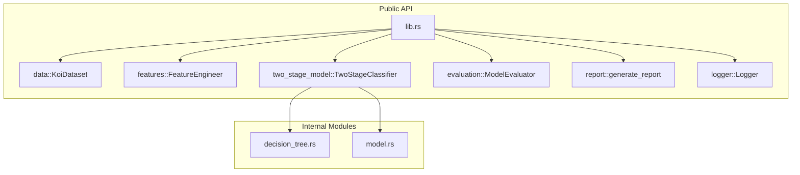
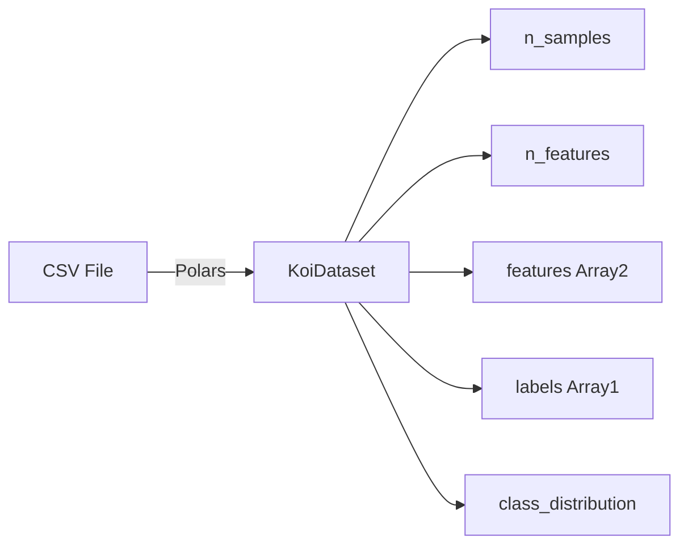
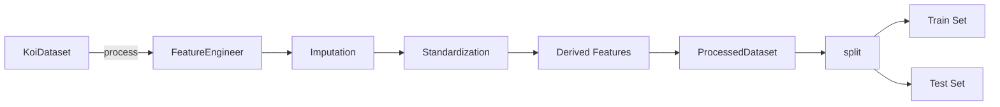
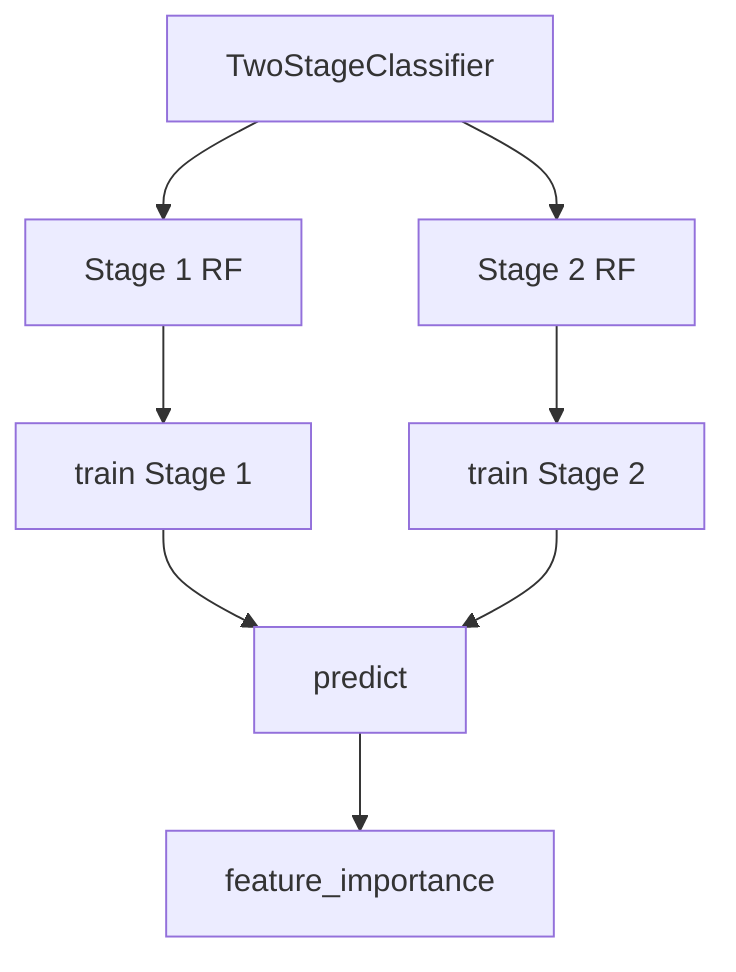
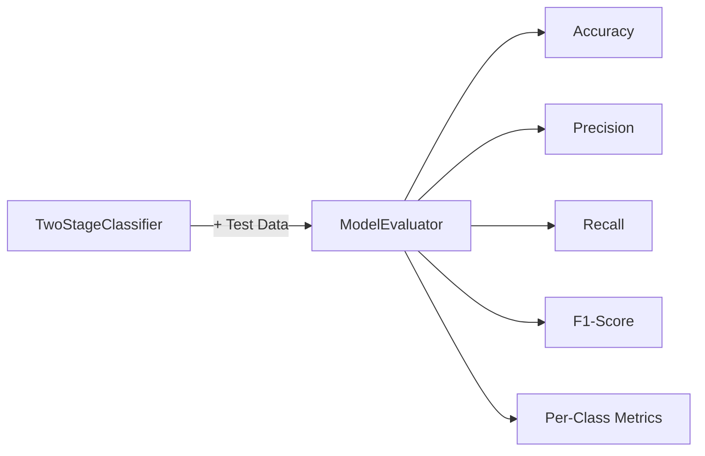
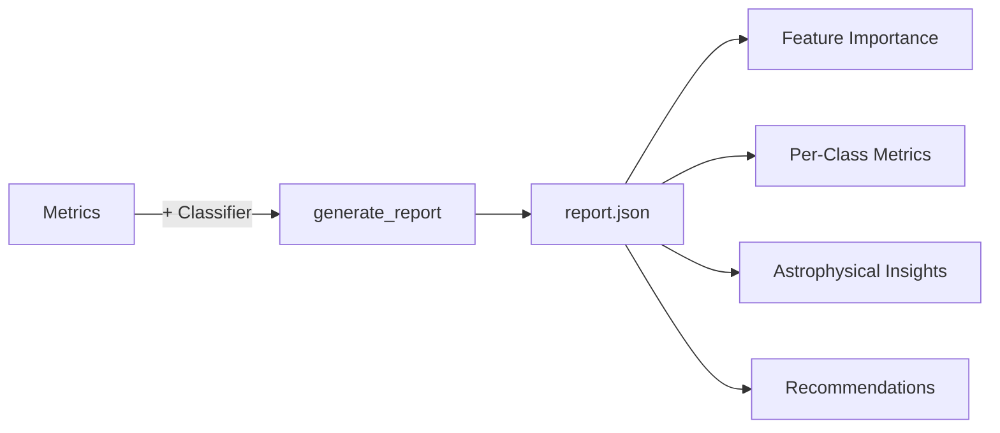
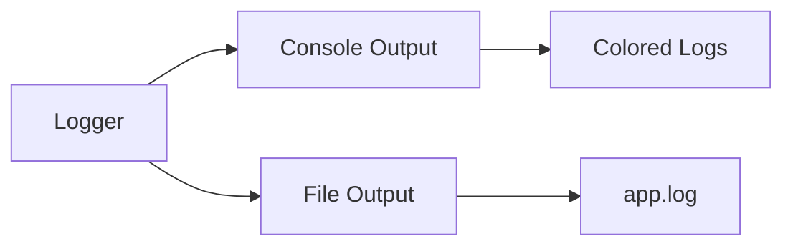
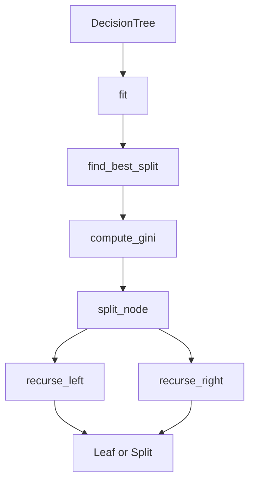
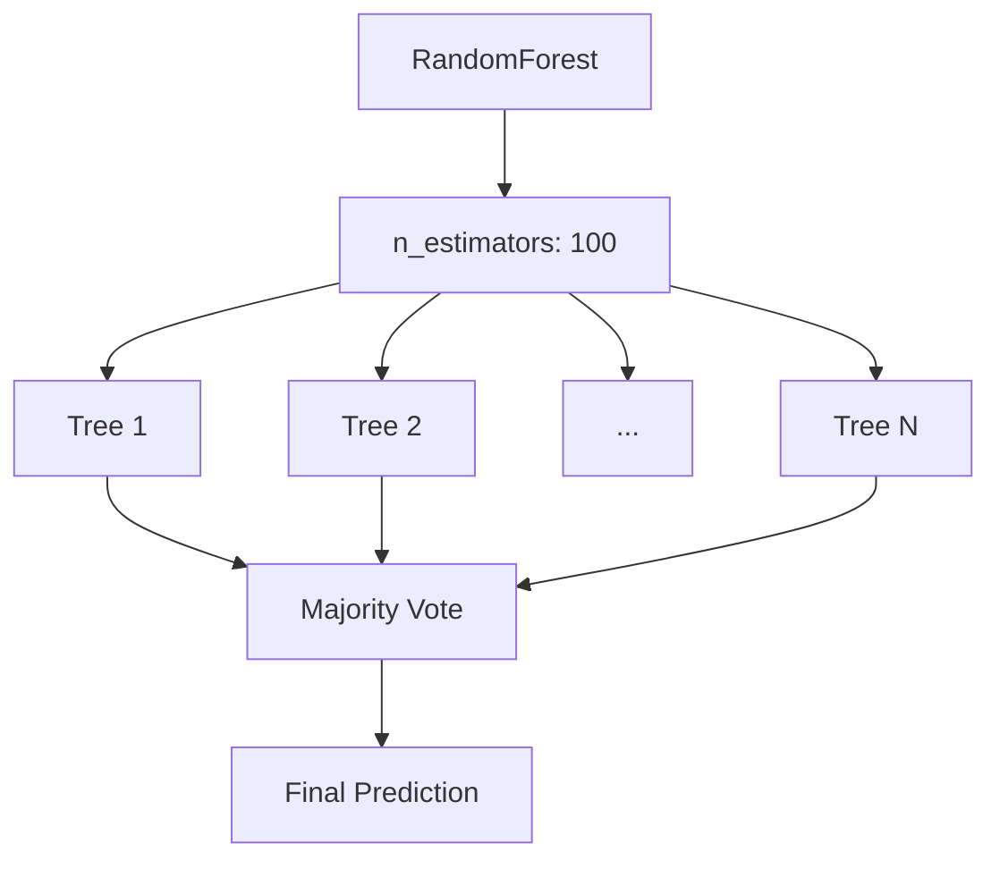

# API Reference

## Module Overview



---

## `data::KoiDataset`

Loads and manages the KOI dataset from CSV using Polars.



### Methods

| Method | Signature | Description |
|--------|-----------|-------------|
| `load` | `load(path: &str) -> Result<KoiDataset>` | Load dataset from CSV |
| `n_samples` | `n_samples() -> usize` | Number of rows |
| `n_features` | `n_features() -> usize` | Number of feature columns |
| `features` | `features() -> &Array2<f64>` | Feature matrix |
| `labels` | `labels() -> &Array1<u8>` | Label vector |
| `class_distribution` | `class_distribution() -> HashMap<String, usize>` | Count per class |
| `feature_index` | `feature_index(name: &str) -> Option<usize>` | Column index by name |

### Usage

```rust
use astrophage::data::KoiDataset;

let dataset = KoiDataset::load("data/koi_dataset.csv")?;
println!("Loaded {} samples with {} features", 
    dataset.n_samples(), 
    dataset.n_features()
);

let dist = dataset.class_distribution();
for (class, count) in &dist {
    println!("{}: {}", class, count);
}
```

---

## `features::FeatureEngineer`

Transforms raw data into model-ready features through imputation, standardization, and derived feature computation.



### Methods

| Method | Signature | Description |
|--------|-----------|-------------|
| `new` | `new() -> FeatureEngineer` | Create new engineer |
| `process` | `process(&mut self, dataset: &KoiDataset) -> Result<ProcessedDataset>` | Full pipeline |

### `ProcessedDataset` Methods

| Method | Signature | Description |
|--------|-----------|-------------|
| `n_samples` | `n_samples() -> usize` | Number of rows |
| `n_features` | `n_features() -> usize` | Number of columns |
| `features` | `features() -> &Array2<f64>` | Feature matrix |
| `labels` | `labels() -> &Array1<u8>` | Label vector |
| `feature_names` | `feature_names() -> &[String]` | Column names |
| `split` | `split(test_ratio: f64, seed: u64) -> (ProcessedDataset, ProcessedDataset)` | Stratified split |

### Usage

```rust
use astrophage::features::FeatureEngineer;

let mut engineer = FeatureEngineer::new();
let processed = engineer.process(&dataset)?;

let (train, test) = processed.split(0.2, 42); // 80/20, seed=42
println!("Train: {}, Test: {}", train.n_samples(), test.n_samples());
```

---

## `two_stage_model::TwoStageClassifier`

The main two-stage random forest classifier.



### Methods

| Method | Signature | Description |
|--------|-----------|-------------|
| `new` | `new() -> TwoStageClassifier` | Create new classifier |
| `train` | `train(&mut self, train: &ProcessedDataset) -> Result<()>` | Train both stages |
| `predict` | `predict(&self, features: &Array2<f64>) -> Vec<u8>` | Predict labels |
| `predict_proba` | `predict_proba(&self, features: &Array2<f64>) -> Vec<Vec<f64>>` | Predict probabilities |
| `feature_importance` | `feature_importance() -> Vec<(String, f64)>` | Feature importance scores |

### Usage

```rust
use astrophage::two_stage_model::TwoStageClassifier;

let mut classifier = TwoStageClassifier::new();
classifier.train(&train)?;

// Predictions
let predictions = classifier.predict(test.features());

// Feature importance
for (name, score) in classifier.feature_importance().iter().take(10) {
    println!("{}: {:.4}", name, score);
}
```

---

## `evaluation::ModelEvaluator`

Computes comprehensive classification metrics.



### Methods

| Method | Signature | Description |
|--------|-----------|-------------|
| `new` | `new(classifier: &TwoStageClassifier, test: &ProcessedDataset) -> ModelEvaluator` | Create evaluator |
| `evaluate` | `evaluate(&self) -> Result<Metrics>` | Compute all metrics |

### `Metrics` Structure

```rust
pub struct Metrics {
    pub accuracy: f64,
    pub macro_f1: f64,
    pub weighted_f1: f64,
    pub per_class: HashMap<String, ClassMetrics>,
}

pub struct ClassMetrics {
    pub precision: f64,
    pub recall: f64,
    pub f1_score: f64,
}
```

### Usage

```rust
use astrophage::evaluation::ModelEvaluator;

let evaluator = ModelEvaluator::new(&classifier, &test);
let metrics = evaluator.evaluate()?;

println!("Accuracy: {:.4f}", metrics.accuracy);
println!("Macro F1: {:.4f}", metrics.macro_f1);

for (class, m) in &metrics.per_class {
    println!("{}: P={:.4f} R={:.4f} F1={:.4f}", 
        class, m.precision, m.recall, m.f1_score);
}
```

---

## `report::generate_report`

Generates the comprehensive JSON report.



### Function

```rust
pub fn generate_report(
    metrics: &Metrics, 
    classifier: &TwoStageClassifier
) -> Result<()>
```

Output: `output/report.json`

### Report Structure

```json
{
  "project_name": "Astrophage",
  "version": "0.2.0",
  "summary": { ... },
  "metrics": { ... },
  "feature_importance": [ ... ],
  "astrophysical_insights": [ ... ],
  "recommendations": [ ... ]
}
```

---

## `logger::Logger`

Structured logging with tracing.



### Methods

| Method | Signature | Description |
|--------|-----------|-------------|
| `init` | `init(console: bool) -> Result<()>` | Initialize logger |

### Usage

```rust
use astrophage::logger::Logger;

Logger::init(true).await?;
tracing::info!("Training started...");
```

---

## Internal: `decision_tree::DecisionTree`

Custom decision tree implementation using Gini impurity.



### Key Parameters

| Parameter | Default | Description |
|-----------|---------|-------------|
| `max_depth` | 10 | Maximum tree depth |
| `min_samples_leaf` | 5 | Minimum samples per leaf |
| `max_features` | sqrt(n) | Features considered per split |

---

## Internal: `model::RandomForest`

Ensemble of decision trees with bootstrap sampling.



### Key Parameters

| Parameter | Default | Description |
|-----------|---------|-------------|
| `n_estimators` | 100 | Number of trees |
| `max_depth` | 10 | Max depth per tree |
| `max_features` | sqrt(n) | Feature subsampling ratio |
| `bootstrap` | true | Use bootstrap sampling |

---

## Data Schema

Expected columns in `koi_dataset.csv`:

### Orbital Parameters
| Column | Unit | Description |
|--------|------|-------------|
| `koi_period` | days | Orbital period |
| `koi_duration` | hours | Transit duration |
| `koi_depth` | ppm | Transit depth |
| `koi_impact` | — | Impact parameter |
| `koi_ingress` | hours | Ingress duration |
| `koi_incl` | deg | Orbital inclination |
| `koi_eccen` | — | Eccentricity |
| `koi_sma` | AU | Semi-major axis |

### Physical Parameters
| Column | Unit | Description |
|--------|------|-------------|
| `koi_ror` | — | Radius ratio (planet/star) |
| `koi_prad` | R⊕ | Planetary radius |
| `koi_teq` | K | Equilibrium temperature |
| `koi_insol` | Earth flux | Insolation flux |

### Signal Quality
| Column | Description |
|--------|-------------|
| `koi_model_snr` | Signal-to-noise ratio |
| `koi_count` | Number of KOIs in system |
| `koi_num_transits` | Number of detected transits |
| `koi_max_sngle_ev` | Max single event statistic |
| `koi_max_mult_ev` | Max multiple event statistic |

### False Positive Flags
| Column | Description |
|--------|-------------|
| `koi_fpflag_nt` | Not Transit-like |
| `koi_fpflag_ss` | Stellar Eclipse |
| `koi_fpflag_co` | Centroid Offset |
| `koi_fpflag_ec` | Ephemeris Match |

### Stellar Parameters
| Column | Unit | Description |
|--------|------|-------------|
| `koi_kepmag` | mag | Kepler magnitude |
| `koi_dor` | — | Duration/period ratio |
| `koi_srho` | g/cm³ | Stellar density |
| `koi_steff` | K | Stellar effective temperature |
| `koi_slogg` | cm/s² | Surface gravity (log) |
| `koi_smet` | dex | Metallicity |
| `koi_srad` | R☉ | Stellar radius |
| `koi_smass` | M☉ | Stellar mass |
