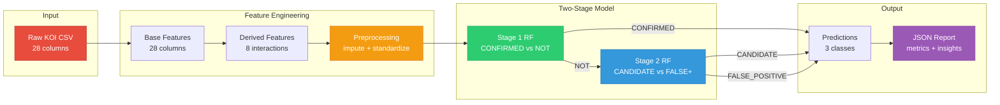
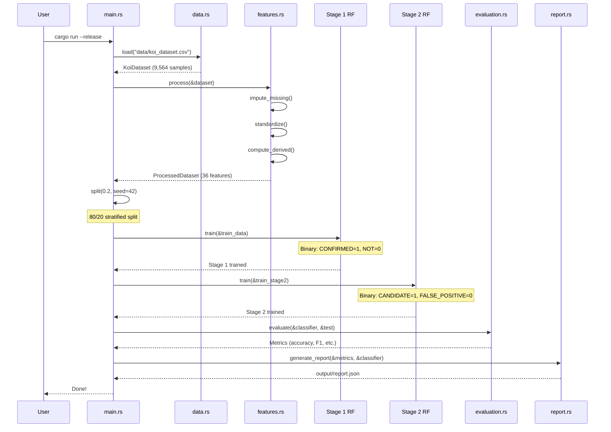
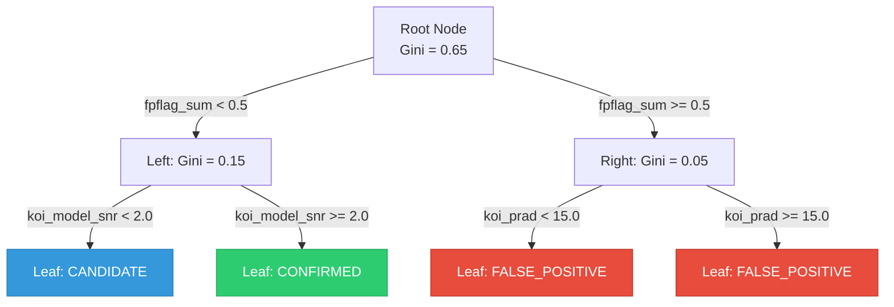
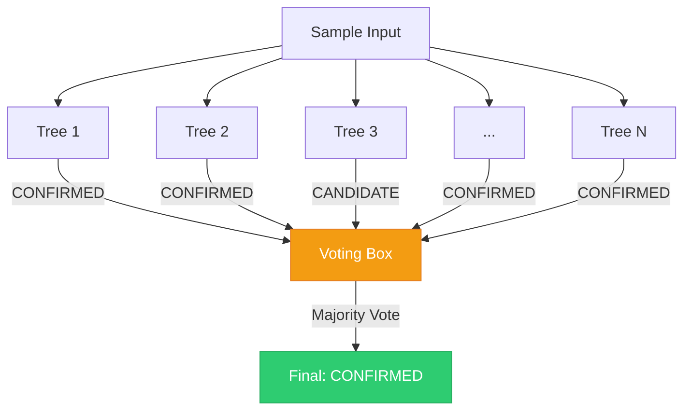
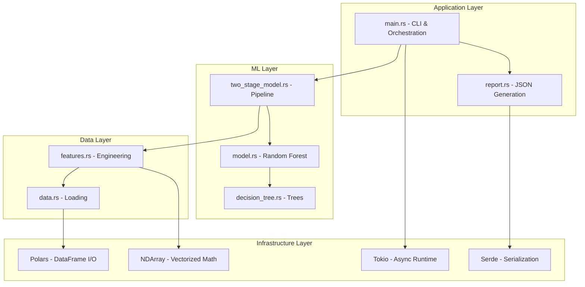
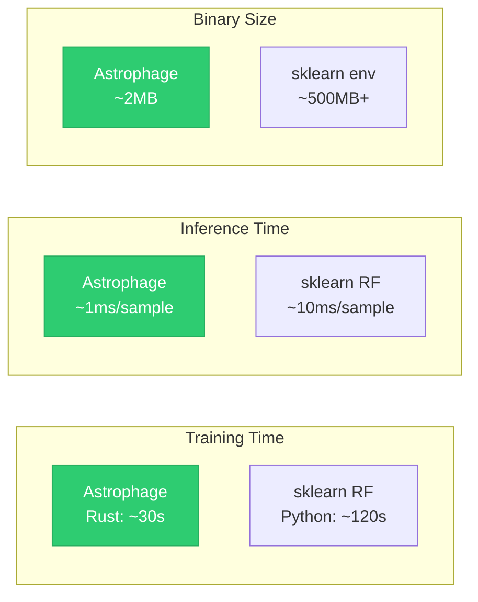

# System Architecture

## High-Level Overview

Astrophage follows a clean pipeline architecture from raw data to final predictions:



---

## Data Flow



---

## Random Forest Internals

### Single Decision Tree



### Ensemble Voting



---

## Technology Layers



---

## Performance Comparison



---

## Memory Layout

```mermaid
graph TD
    subgraph "Training Data"
        A[Features Array2<br/>f64 x (n_samples x 36)]
        B[Labels Array1<br/>u8 x n_samples]
    end

    subgraph "Stage 1 Model"
        C[100 Decision Trees]
        C1[Tree 1: ~50 nodes]
        C2[Tree 2: ~50 nodes]
        C3[Tree N: ~50 nodes]
    end

    subgraph "Stage 2 Model"
        D[100 Decision Trees]
        D1[Tree 1: ~50 nodes]
        D2[Tree 2: ~50 nodes]
        D3[Tree N: ~50 nodes]
    end

    A --> C
    A --> D
    B --> C
    B --> D
```
