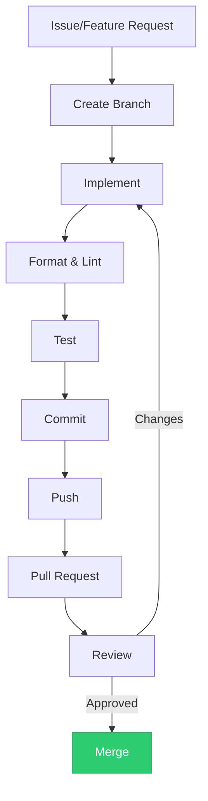
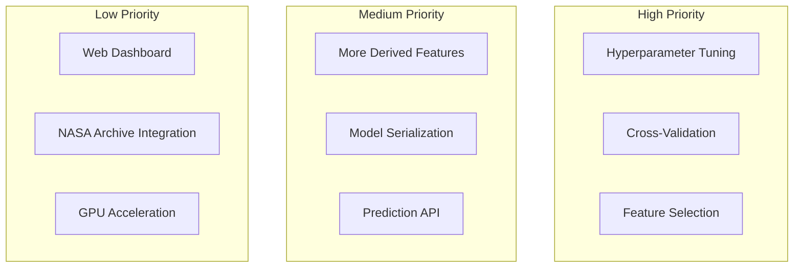
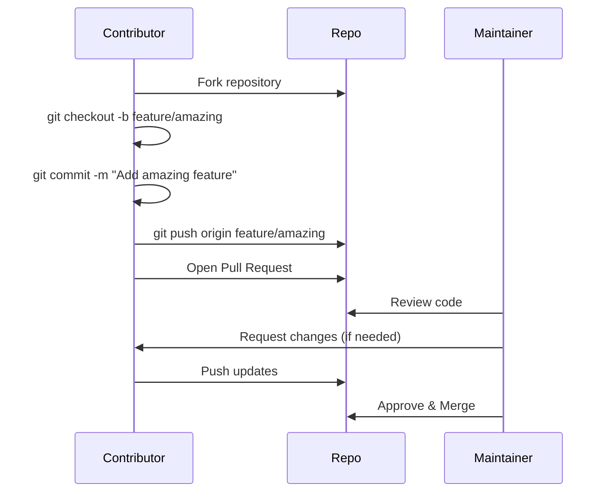

# Contributing to Astrophage

Thank you for your interest in contributing! Astrophage is a Rust-based exoplanet classification project, and we welcome contributions of all kinds.


---

## Getting Started

### Prerequisites

- Rust 1.85+ (install via [rustup](https://rustup.rs/))
- Git

### Setup

```bash
# Clone your fork
git clone https://github.com/YOUR_USERNAME/astrophage.git
cd astrophage

# Build
cargo build --release

# Run tests
cargo test
```

---

## Development Workflow



### Code Style

We follow standard Rust conventions:

```bash
# Format code
cargo fmt

# Run linter
cargo clippy

# Generate docs
cargo doc --open
```

---

## Areas for Contribution



### High Priority

1. **Hyperparameter tuning** — Grid search over tree depth, n_estimators, max_features
2. **Cross-validation** — K-fold stratified CV implementation
3. **Feature selection** — Recursive feature elimination to find optimal subset

### Medium Priority

4. **Additional derived features** — More astrophysical interactions
5. **Model serialization** — Save/load trained models to avoid retraining
6. **Prediction API** — REST API for real-time classification

### Low Priority

7. **Web dashboard** — Visualize predictions and feature importance
8. **NASA Archive integration** — Direct API connection for live data
9. **GPU acceleration** — CUDA kernels for tree training

---

## Submitting Changes



### Pull Request Guidelines

- Describe what changed and why
- Reference any related issues
- Include test results
- Keep changes focused and atomic

---

## Code of Conduct

- Be respectful and inclusive
- Focus on constructive feedback
- Help others learn
- Credit original authors

## Questions?

Open an issue or reach out to [@harihar-nautiyal](https://github.com/harihar-nautiyal).
