# Feature Engineering

## Philosophy

Feature engineering is where astrophysics meets machine learning. We don't just throw raw data at a model — we encode domain knowledge about how planets, stars, and false positives behave.

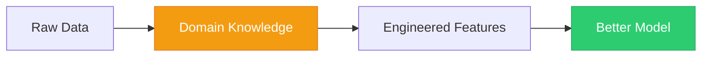

---

## Base Features (28)

These are the raw astrophysical measurements from the Kepler pipeline:

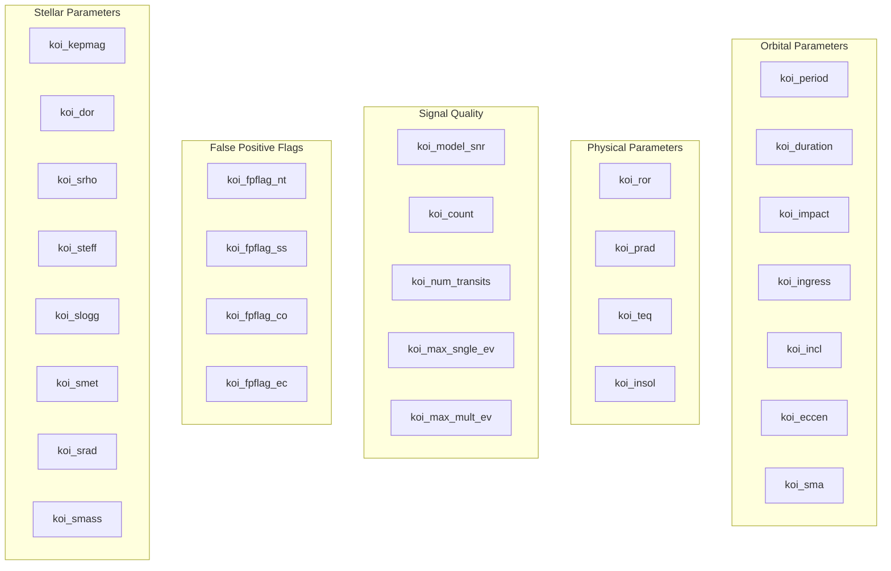

---

## Derived Features (8)

These are where the magic happens. Each derived feature encodes a specific astrophysical insight:

### 1. `fpflag_sum` — Total Suspicion Score

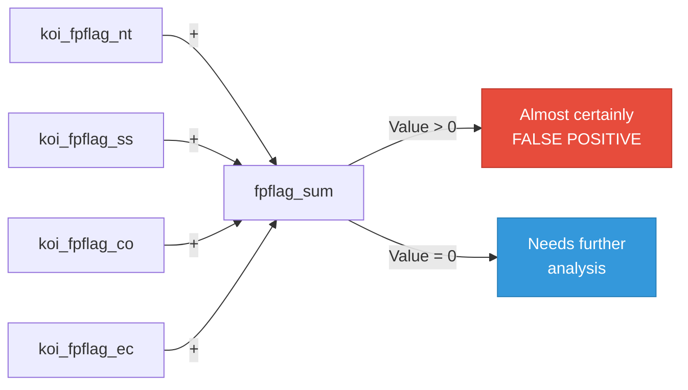

> **Importance: 0.2918** — The single most important feature. NASA already did the hard work of flagging suspicious signals; we just aggregate those flags.

---

### 2. `snr_x_prad` — Signal Consistency

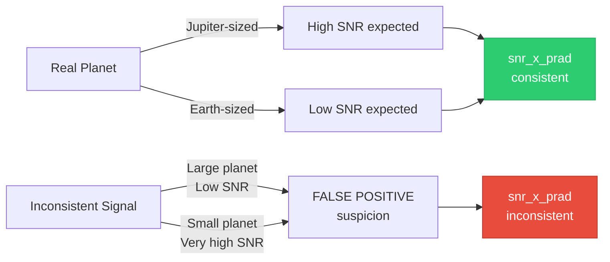

> **Importance: 0.0390** — Real planets have SNR proportional to their size. A Jupiter-sized object with weak SNR is suspicious.

---

### 3. `depth_duration_ratio` — Transit Shape

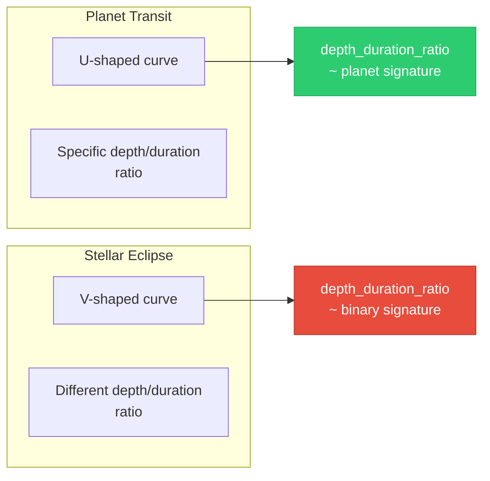

> **Importance: 0.0239** — Planets produce U-shaped transits; stellar binaries produce V-shaped eclipses. The ratio captures this difference.

---

### 4. `koi_prad_squared` — Non-Linear Radius Effect

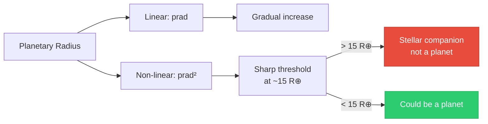

> **Importance: 0.0275** — Objects larger than ~15 Earth radii are almost certainly stellar companions, not planets. The squared term captures this threshold.

---

### 5. `impact_penalty` — Physical Impossibility

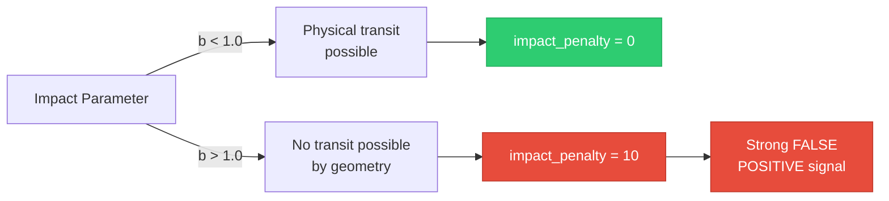

> An impact parameter > 1.0 means the planet would miss the star entirely. Any signal with this value is physically impossible as a transit.

---

### 6. `log_period` — Orbital Distribution

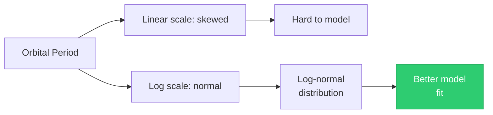

> Planetary orbital periods follow a log-normal distribution. Taking the log makes the feature more Gaussian and easier for the model to learn.

---

### 7. `teq_over_steff` — Temperature Sanity Check

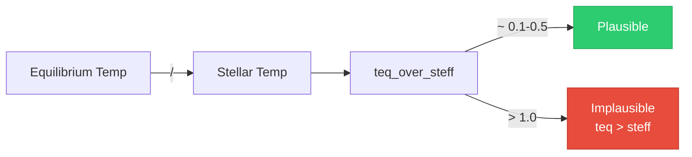

> A planet's equilibrium temperature should never exceed its host star's temperature. This ratio is a simple sanity check.

---

### 8. `prad_teq_interaction` — Size-Temperature Relationship

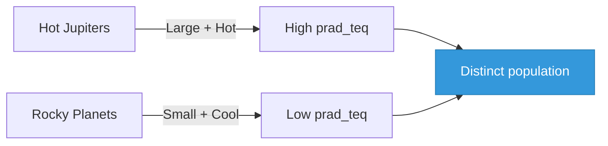

> This interaction helps distinguish between giant planets (large + hot) and rocky planets (small + cool).

---

## Feature Importance Ranking

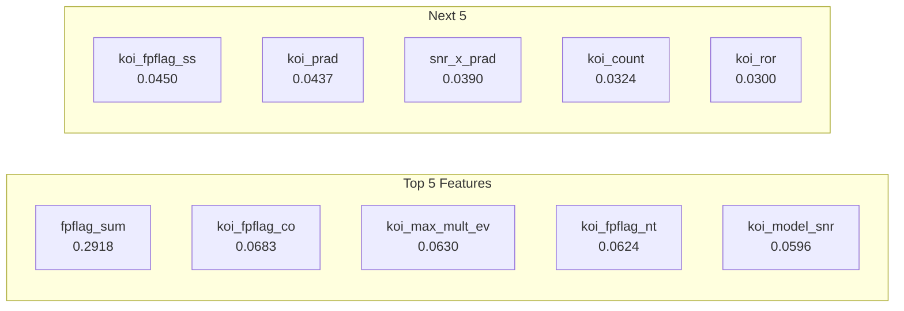

---

## Preprocessing Pipeline

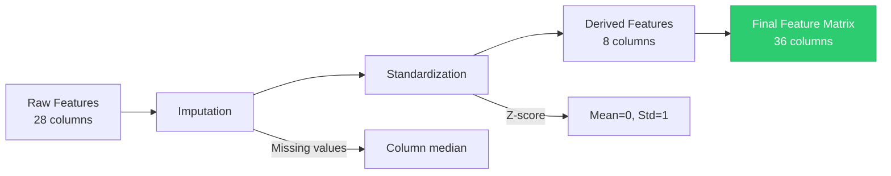

### Missing Value Imputation

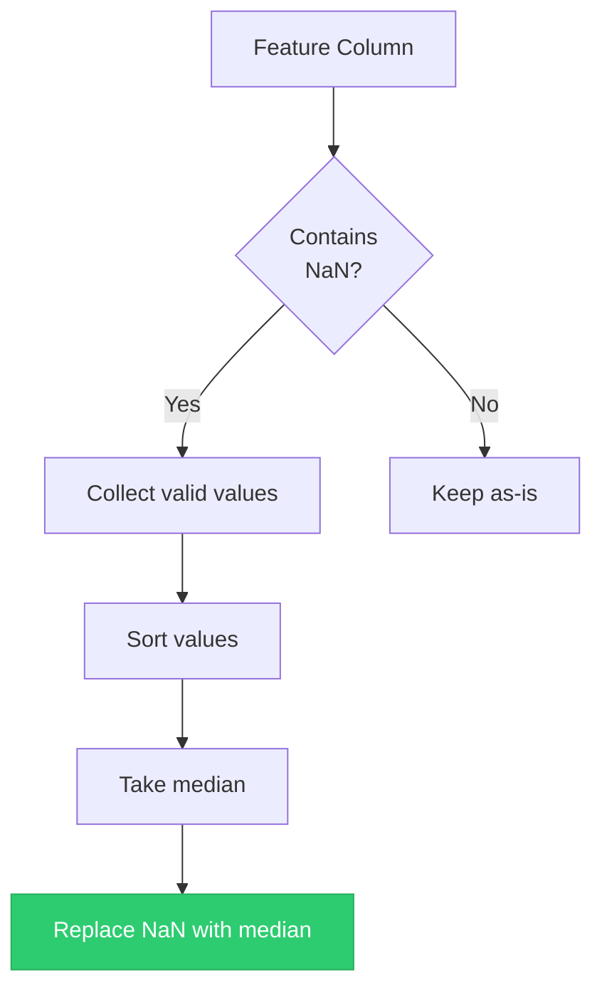

### Z-Score Standardization

```mermaid
graph LR
    A[Raw Value x] --> B[Subtract Mean]
    B --> C[Divide by Std]
    C --> D[Standardized Value<br/>(x - μ) / σ]

    style D fill:#2ecc71,stroke:#27ae60,color:#fff
```

> Standardization ensures all features contribute equally to distance-based calculations. Without it, features with large scales (like period in days) would dominate over small-scale features (like impact parameter).

---

## Feature Correlation Insight

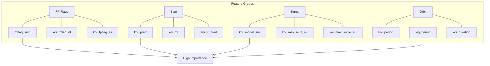
