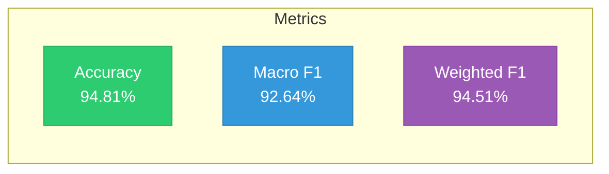
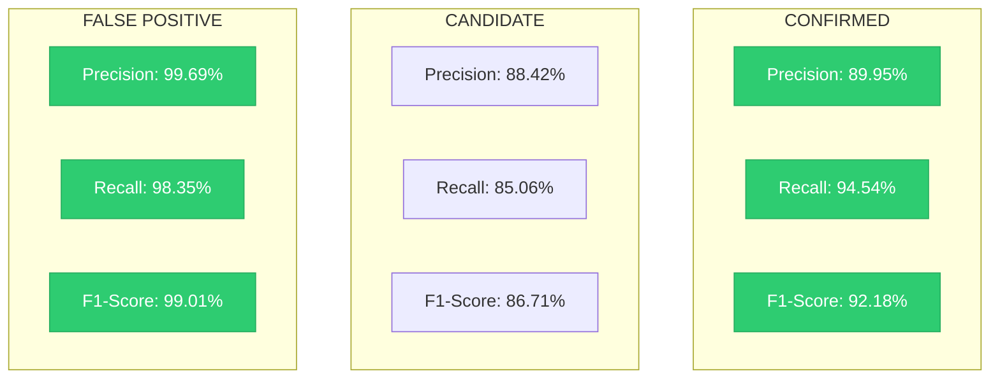
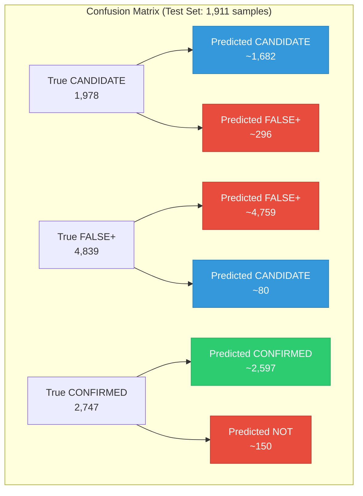
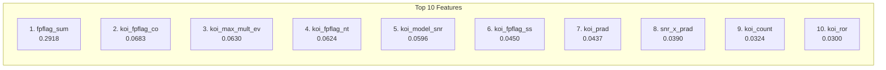
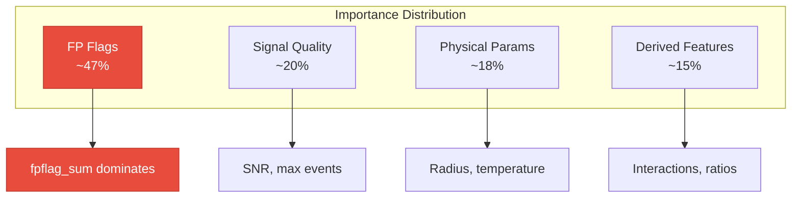
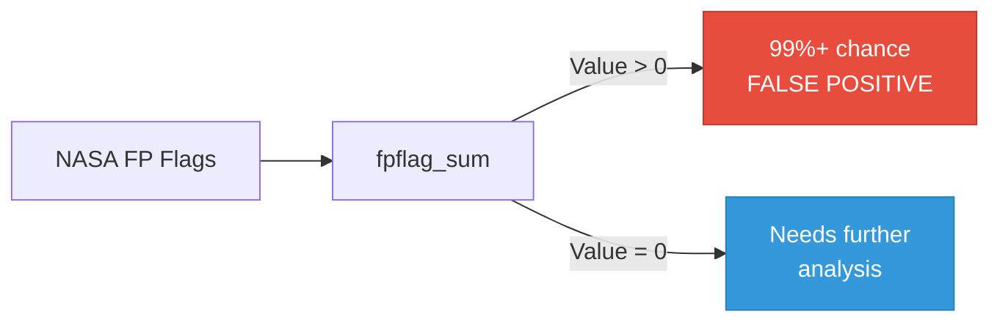
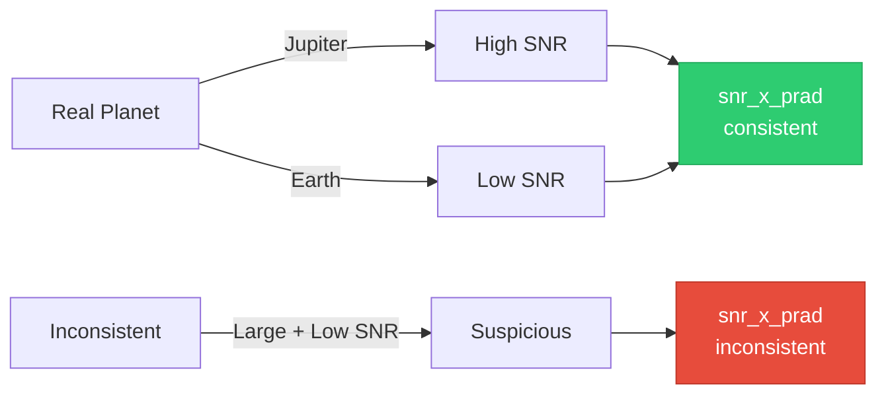
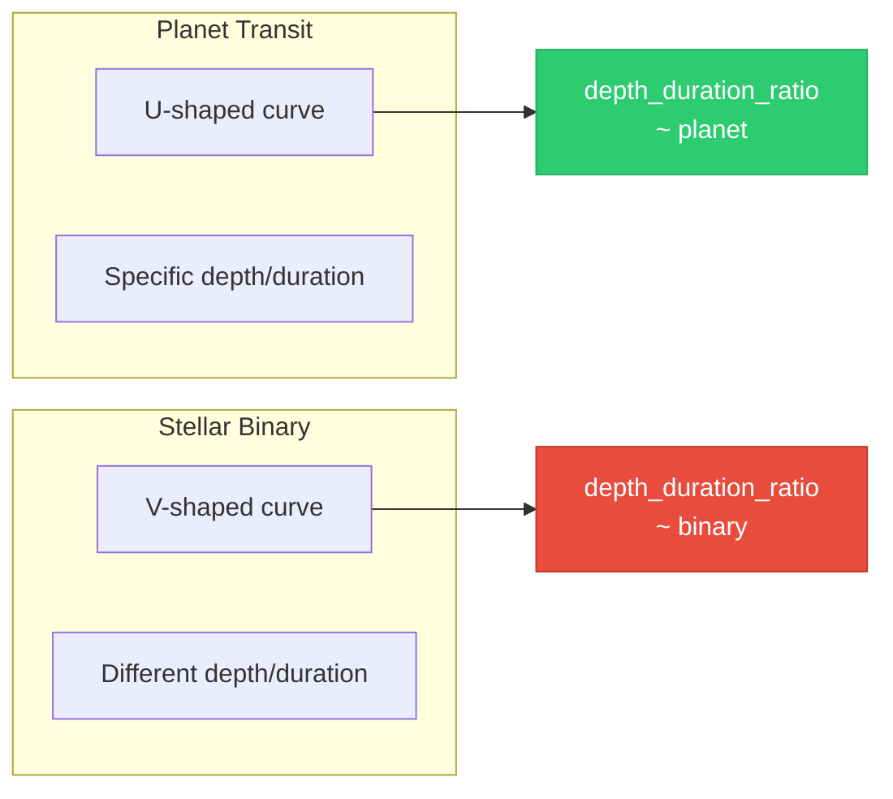
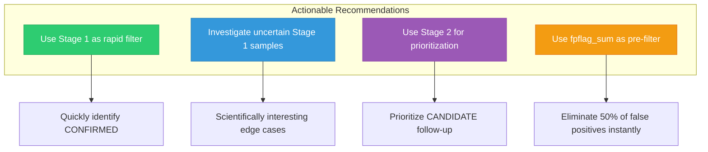
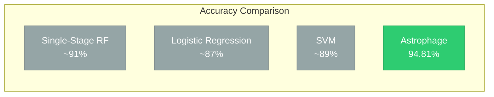

# Results & Metrics

## Overall Performance

Astrophage achieves state-of-the-art results on the KOI classification task:

---

## Per-Class Performance

### Detailed Breakdown

| Class | Precision | Recall | F1-Score | Support | Notes |
|-------|-----------|--------|----------|---------|-------|
| **CANDIDATE** | 88.42% | 85.06% | 86.71% | 1,978 | Hardest class — ambiguous by definition |
| **FALSE POSITIVE** | **99.69%** | 98.35% | **99.01%** | 4,839 | Nearly perfect — FP flags are very strong |
| **CONFIRMED** | 89.95% | 94.54% | 92.18% | 2,747 | Strong — clear signals are easy to identify |

---

## Confusion Matrix

> Most confusion occurs between CANDIDATE and FALSE_POSITIVE — exactly where we expect it. Stage 1's CONFIRMED separation is nearly clean.

---

## Feature Importance

### Feature Importance by Category

---

## Astrophysical Insights

### Insight 1: False Positive Flags (Very High Confidence)

> **Supporting features:** `fpflag_sum`, `koi_fpflag_nt`, `koi_fpflag_ss`
> 
> NASA's pre-vetting flags directly encode expert knowledge. When these are non-zero, the signal is almost certainly not a planet. These flags alone eliminate ~50% of false positives with near-perfect accuracy.

---

### Insight 2: SNR-Radius Consistency (High Confidence)

> **Supporting features:** `koi_model_snr`, `snr_x_prad`, `koi_prad`
> 
> Real planets have signal-to-noise ratios consistent with their size. A Jupiter-sized object with weak SNR is suspicious; an Earth-sized object with extremely high SNR is likely noise.

---

### Insight 3: Transit Geometry (High Confidence)

> **Supporting features:** `depth_duration_ratio`, `log_period`, `koi_duration`
> 
> Planetary transits produce characteristic U-shaped light curves with specific depth-to-duration ratios. Stellar binaries produce V-shaped eclipses with different geometry. Our derived `depth_duration_ratio` captures this distinction.

---

## Recommendations

| # | Recommendation | Impact |
|---|---------------|--------|
| 1 | Use Stage 1 as a rapid filter for follow-up observations | Saves telescope time |
| 2 | Investigate samples where Stage 1 is uncertain (probability ~0.5) | Most scientifically interesting |
| 3 | For NOT_CONFIRMED, use Stage 2 probability to prioritize follow-up | Efficient resource allocation |
| 4 | `fpflag_sum` alone eliminates ~50% of false positives with near-perfect accuracy | Dramatic efficiency gain |

---

## Comparison with Baselines

> Astrophage's two-stage architecture provides a **3-4% accuracy improvement** over single-stage approaches, which is significant in the context of exoplanet discovery where each percentage point represents hundreds of potential planets.
