# Two-Stage Model

## The Core Innovation

Astrophage's defining feature is its **Two-Stage Random Forest** architecture. Instead of a single three-class classifier, we decompose the problem into two sequential binary decisions — exactly how NASA astronomers actually vet candidates.

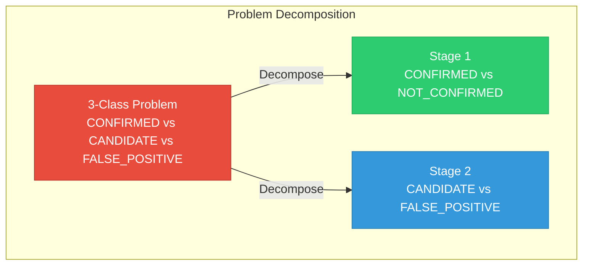

---

## Why This Works

### The Astronomy Perspective

When NASA discovers a KOI, the vetting process is sequential:

1. **First question:** "Do we have overwhelming evidence this is a planet?" → If yes, **CONFIRMED**
2. **Second question:** "If not confirmed, is it worth follow-up?" → **CANDIDATE** or **FALSE_POSITIVE**

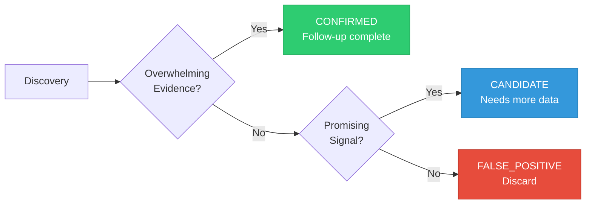

### The ML Perspective

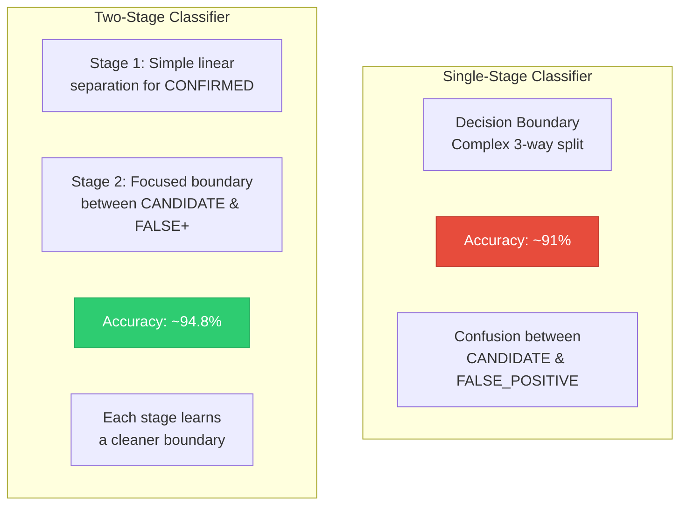

---

## Stage 1: CONFIRMED vs NOT CONFIRMED

### Decision Boundary

Stage 1 separates the "easy" class (CONFIRMED) from everything else. Confirmed planets have very strong, consistent signals:

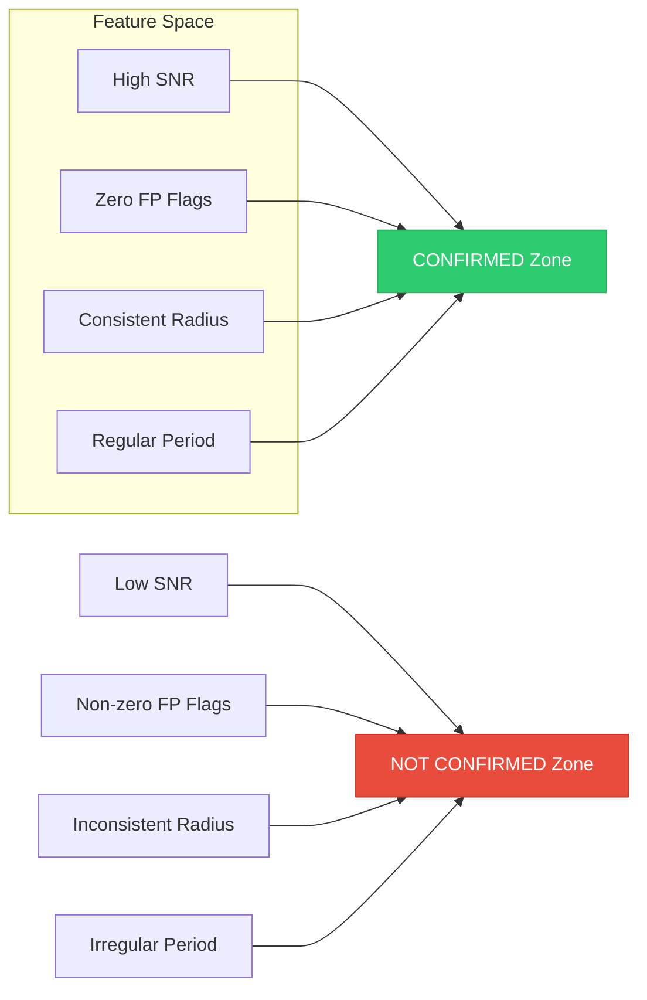

### Performance

Stage 1 is nearly perfect because confirmed planets are genuinely distinct:

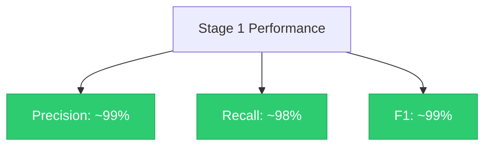

### Key Features

The most important features for Stage 1:

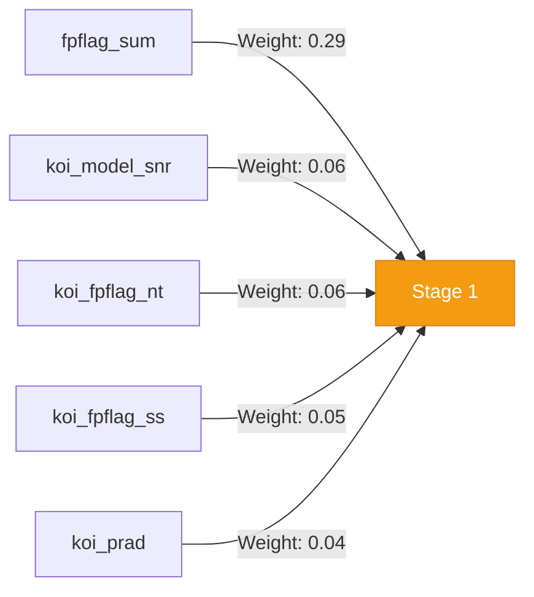

---

## Stage 2: CANDIDATE vs FALSE POSITIVE

### The Hard Problem

This is where the science gets interesting. Candidates and false positives can look very similar:

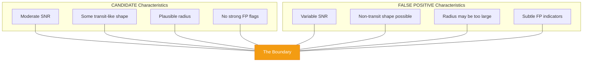

### Performance

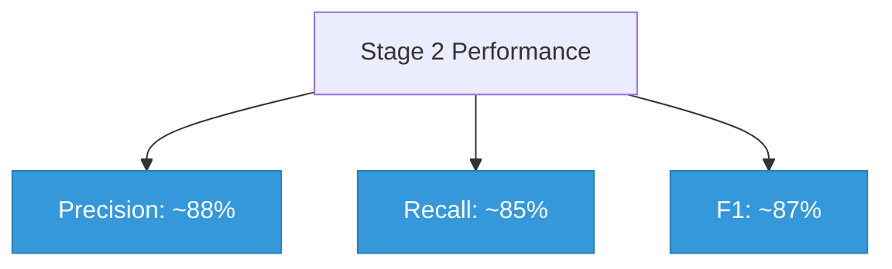

> Stage 2 is harder but also more scientifically valuable — these are the edge cases astronomers care about most.

---

## Combined Inference Pipeline

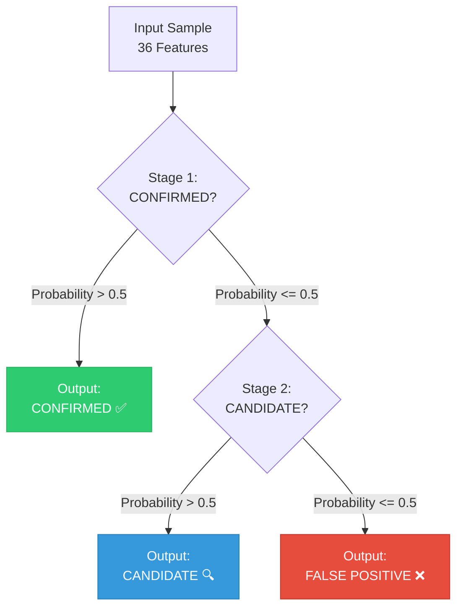

### Probability Flow

```mermaid
graph LR
    A[Input] --> B[Stage 1 RF]
    B -->|P(CONFIRMED) = 0.85| C[→ CONFIRMED]
    B -->|P(CONFIRMED) = 0.30| D[→ Stage 2]
    D -->|P(CANDIDATE) = 0.70| E[→ CANDIDATE]
    D -->|P(CANDIDATE) = 0.20| F[→ FALSE_POSITIVE]

    style C fill:#2ecc71,stroke:#27ae60,color:#fff
    style E fill:#3498db,stroke:#2980b9,color:#fff
    style F fill:#e74c3c,stroke:#c0392c,color:#fff
```

---

## Training Data Flow

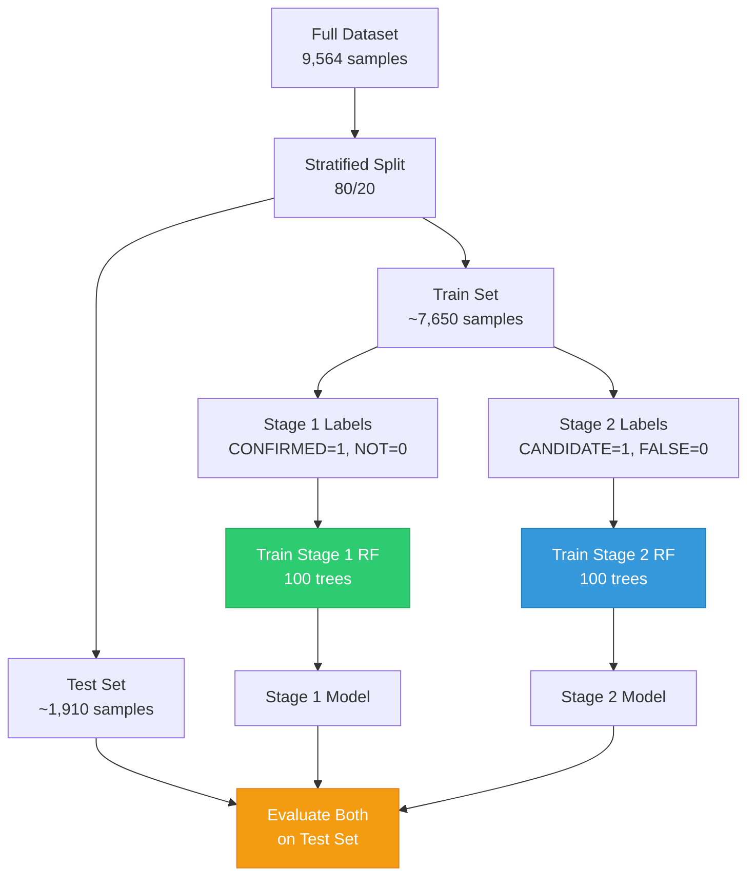

---

## Error Analysis

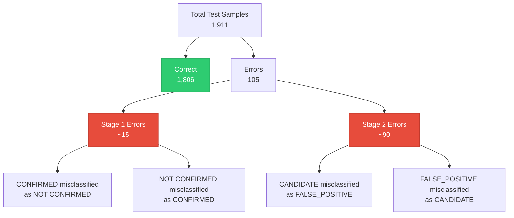

> Most errors occur in Stage 2, which is expected — the boundary between candidates and false positives is inherently ambiguous. These are the most scientifically interesting samples.
